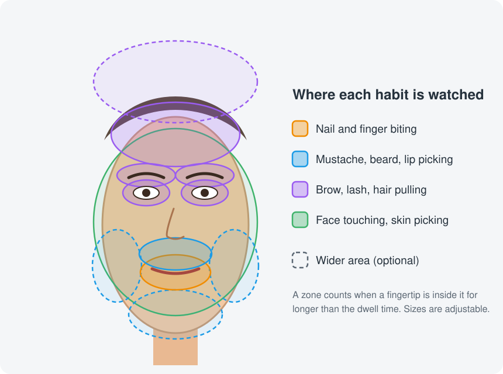
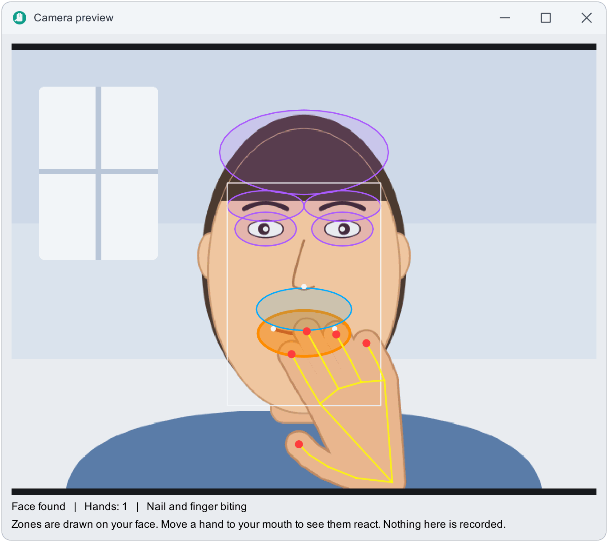
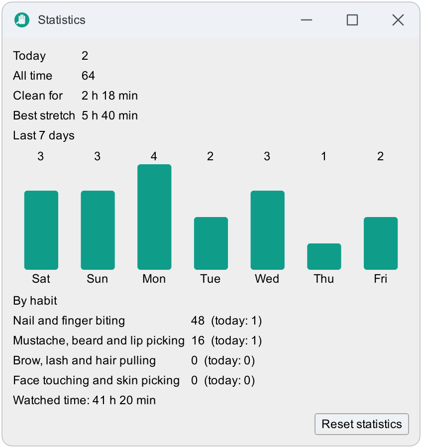
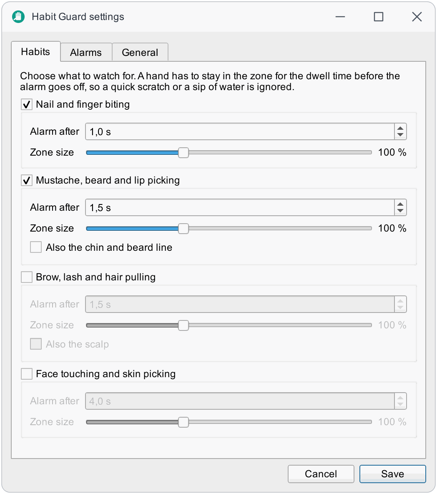
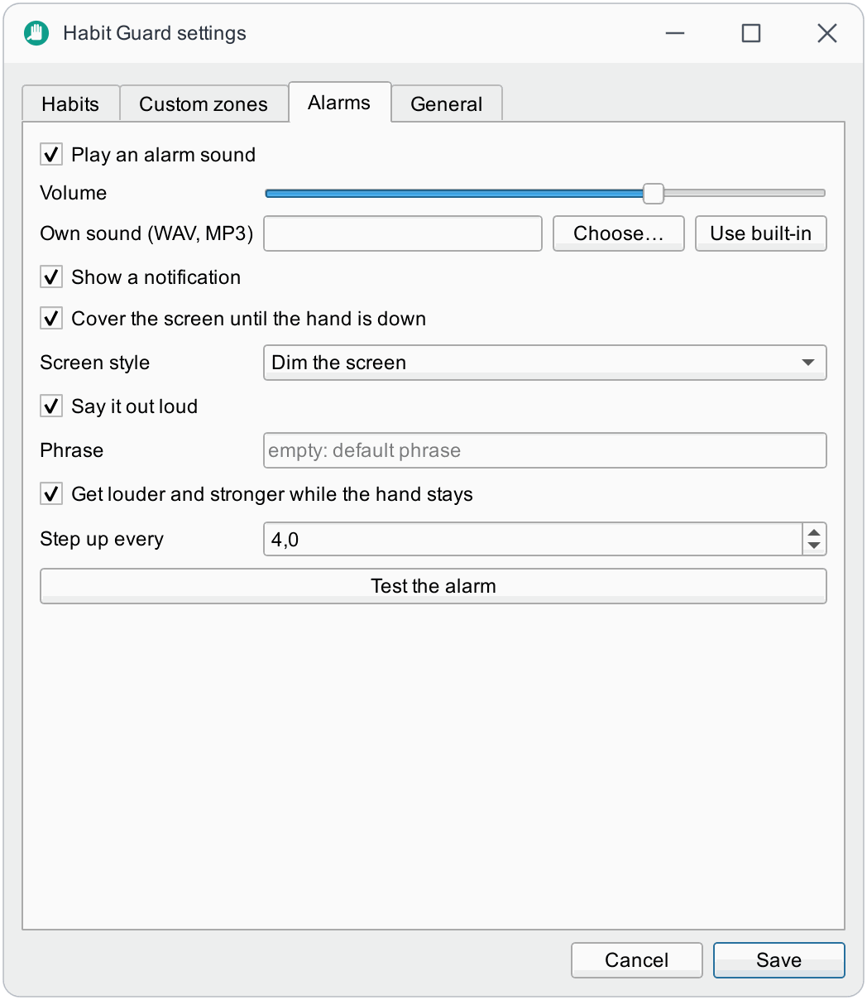
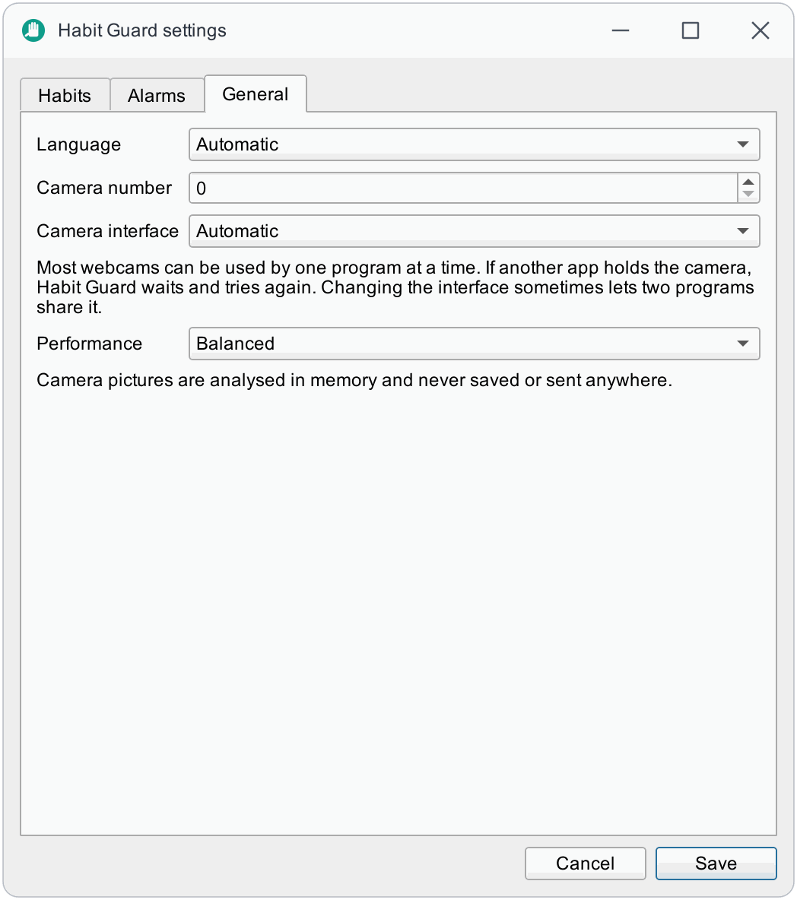
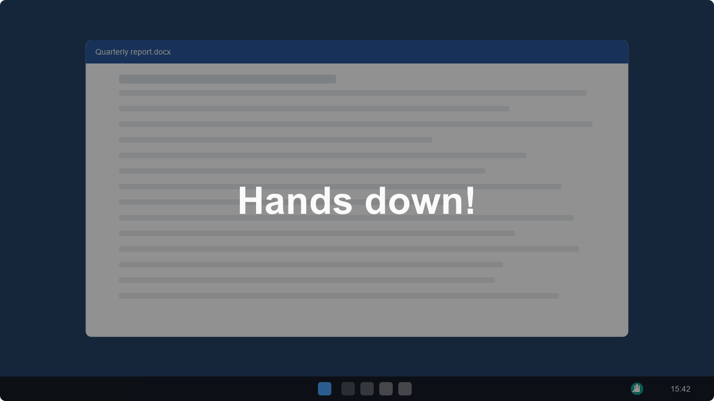
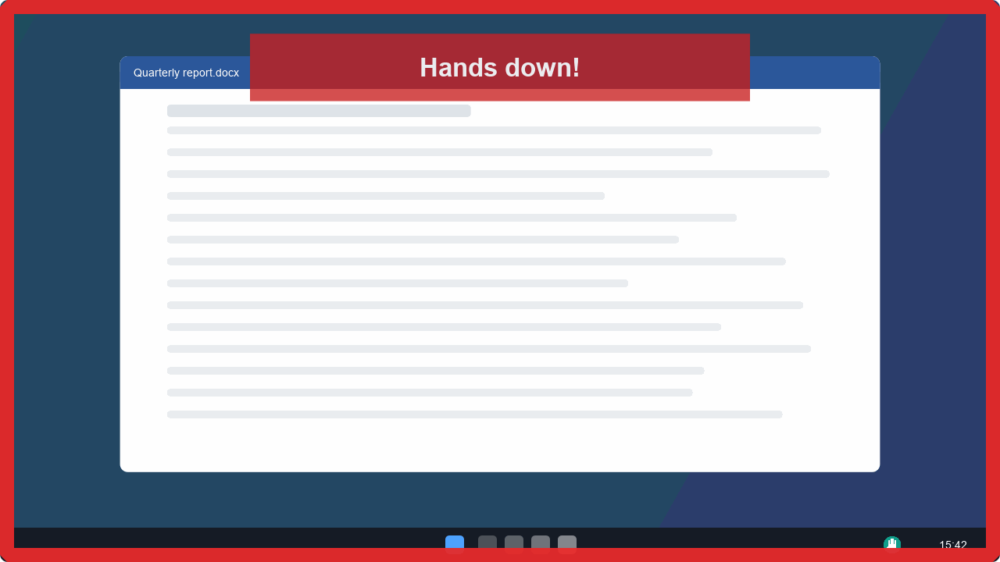
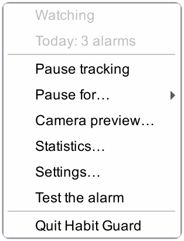
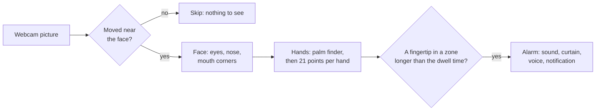

<p align="center">
  
</p>

<h1 align="center">Habit Guard</h1>

<p align="center">
  Catches the hand on its way to your mouth, mustache, brows or hair, and nudges you to stop.<br>
  Webcam-based, offline and light on the CPU. Windows, macOS and Linux.
</p>

<p align="center">
  <a href="https://github.com/bugraskl/habit-guard/actions/workflows/ci.yml"></a>
  <a href="docs/privacy.md"></a>
  <a href="docs/privacy.md"></a>
  <a href="LICENSE"></a>
</p>

<p align="center">
  <a href="https://bugraskl.github.io/habit-guard/"><b>Website</b></a> · <b>English</b> · <a href="README.tr.md">Türkçe</a>
</p>

> **Status: alpha.** Detection, alarms and the interface are built and covered by automated tests,
> and detection was checked on sample photos and replayed video. It has had very little time on
> live webcams and real desks so far, so reports about false alarms and misses are the most useful
> contribution right now ([how to report](CONTRIBUTING.md#reporting-a-problem)).

## Why Habit Guard

Biting nails, pulling at a mustache, plucking brows or lashes, picking at skin: these habits run on
autopilot. By the time you notice, the hand has been there for minutes. Habit Guard watches your
webcam, notices when a fingertip goes to the place where *your* habit happens and stays there, and
interrupts it at once, so the habit gets harder to run without noticing.

Everything happens on your computer. The picture from the camera is looked at in memory and thrown
away; only counters are kept.

## What it watches

<p align="center">
  
</p>

| Habit | Where | Wider area (optional) |
|---|---|---|
| **Nail and finger biting** | the lips and the area around them | |
| **Mustache, beard and lip picking** | between the nose and the mouth | the chin and the beard line |
| **Brow, lash and hair pulling** | brows, eyelids, forehead and hairline | the scalp |
| **Face touching and skin picking** | the rest of the face | |

Each habit has its own **dwell time** (how long a hand must stay before the alarm goes off, so a
quick scratch or a sip of water is ignored) and its own **zone size**. The zones are measured in
eye distances, so they follow you as you lean in, lean back or tilt your head.

## What happens when it catches you

Pick any combination in **Settings → Alarms**:

| | Alarm | What it does |
|---|---|---|
| 🔔 | **Sound** | A soft chime, then three beeps, then a warbling alarm as you keep going. Volume is adjustable; your own sound file (WAV, MP3, ...) can replace the built-in tones. |
| 🌑 | **Screen curtain** | The screen dims, or a red frame pulses, on every monitor until your hand is down. Clicks pass straight through it, so it can never lock you out. |
| 🗣️ | **Voice** | Says a phrase of your choice ("Hands down.") with your system's offline voice. |
| 💬 | **Notification** | A desktop notification on the first alarm of each episode. |
| 📈 | **Statistics** | Counts per day and per habit, a 7-day chart and a **clean streak**: how long you have been watched since the last alarm. Stored locally. |

With **escalation** on (the default) the alarm steps up every few seconds while the hand stays:
quieter first, louder and darker after. Pause tracking from the tray for 15 minutes, an hour or
three hours when you eat or take a call.

## Screenshots

The windows are the real ones, in English and Turkish. The camera picture in the preview is an illustration, not a photograph: no real face is in this repository.

<p align="center">
  
  
</p>

<p align="center">**Camera preview** shows the zones on your face and the hand's 21 points; **Statistics** keeps a 7-day chart and your clean streak.</p>

<p align="center">
  
  
  
</p>

<p align="center">**Settings**: habits with their own dwell time and zone size, alarms, and general options.</p>

<p align="center">
  
  
</p>

<p align="center">**The alarm**: the screen dims (left) or a red frame pulses (right) until your hand is down. Clicks pass straight through.</p>

<p align="center">
  
</p>

<p align="center">**The tray menu**: pause, pause for a set time, preview, statistics, settings.</p>

More pictures, and a demo you can click, on the [website](https://bugraskl.github.io/habit-guard/).

## How it works



- **Vision.** YuNet finds the face; MediaPipe's palm and hand-landmark networks, run through
  OpenCV's DNN module, find the hands. The MediaPipe *runtime* is not used, because it contains a
  telemetry uploader ([why](docs/privacy.md#why-not-the-mediapipe-runtime)).
- **Cheap by design.** With the hands away, a picture is looked at about twice a second and only
  analysed when something near the face moved. Fast analysis starts when a hand comes close.
- **Decision.** A fingertip in a zone starts a run; short drop-outs do not end it; the alarm fires
  after the dwell time and escalates while the hand stays ([architecture](docs/architecture.md)).

## Privacy

| Promise | Verified by |
|---|---|
| No network access: no telemetry, no accounts, no update check. | `scripts/check_privacy.py` fails CI when any file under `src/` imports a networking library. |
| Camera pictures are analysed in memory and never saved. | The same scan fails CI on OpenCV's image and video writers and on saving Qt pictures. |
| Only numbers are stored: daily counters and your settings, in plain JSON. | `settings.json` and `stats.json` in your config folder. |
| Pausing releases the camera. | The webcam light goes out. |

Details: [privacy](docs/privacy.md).

## Performance

Measured with `habit-guard bench` on Windows 11, AMD Ryzen 7 3700X (8 cores, 16 threads), replaying
a 640×480 clip so the run is repeatable. CPU use includes the whole process.

| Situation | Balanced profile |
|---|---|
| Face in view, hands away (most of the day) | **0.34 %** of the machine (5.5 % of one core) |
| Same, **Eco** profile | 0.24 % of the machine |
| A hand near the face (analysis up to 8 times a second) | about 1.3 % of the machine (20 % of one core) |
| One analysis (face + hand) | 20 to 26 ms |

These are replayed-clip numbers: the live camera adds its own driver cost. Run `habit-guard bench`
on your machine to measure yours. Choose a profile under **Settings → General → Performance**.

## Download

| Platform | Package | |
|---|---|---|
| **Windows** 10/11 x64 | Installer `.exe` or portable `.zip` | [Download](https://github.com/bugraskl/habit-guard/releases/latest) |
| **macOS** 14+ Apple silicon | `.dmg` | [Download](https://github.com/bugraskl/habit-guard/releases/latest) |
| **Linux** x86_64 | `.AppImage` or `.tar.gz` | [Download](https://github.com/bugraskl/habit-guard/releases/latest) |

Every release ships `SHA256SUMS.txt` and GitHub build-provenance attestations. Builds are not
code-signed yet: on Windows, SmartScreen may warn (*More info*, then *Run anyway*); on macOS,
right-click the app and choose *Open* the first time, then allow the camera. The Windows installer
is per user (no administrator rights) and can add the `habit-guard` command to your PATH. Building
the packages yourself: [building](docs/building.md).

## Run from source

You need [uv](https://docs.astral.sh/uv/) (it fetches the right Python itself). This is also the way
to run Habit Guard on an Intel Mac.

```bash
git clone https://github.com/bugraskl/habit-guard.git
cd habit-guard
uv sync
uv run habit-guard
```

A hand icon appears in the tray (menu bar on macOS). On first start the settings window opens: pick
the habits you want to watch. Use **Camera preview** in the tray menu to see the zones on your own
face and to check that the camera sees you well.

On Linux you need your distribution's `libxcb-cursor0` (Debian/Ubuntu) or `xcb-util-cursor`
(Fedora, Arch) package, and a desktop with a system tray (GNOME needs an extension for tray icons).

Start with your computer: `habit-guard autostart enable`, or tick the box in the Windows installer.

## Command line

The examples use `habit-guard`; from source that is `uv run habit-guard`, from the Windows
installer it is `habit-guard` in a new terminal (with the PATH option ticked) or
`habit-guard-cli.exe` in the install folder.

```bash
habit-guard                       # start the tray app
habit-guard doctor                # diagnostics for bug reports (no pictures in it)
habit-guard doctor --probe-cameras
habit-guard selftest              # check the models, the vision code, the tones and the windows
habit-guard bench                 # measure CPU use and analysis time
habit-guard stats                 # print your counters
habit-guard autostart enable      # start at login (enable | disable | status)
habit-guard reset                 # forget settings and statistics
habit-guard ctl pause             # control the running app: status, pause, resume, toggle,
                                  # test, settings, preview, stats, quit
habit-guard --camera 1            # use another camera, or --camera clip.mp4 to replay a video
habit-guard --config-dir DIR      # keep settings and statistics in a folder of your choice
```

`habit-guard ctl` lets you bind actions to your own keyboard shortcuts. On Windows, make a shortcut
to `habit-guard-cli.exe ctl toggle` and give it a shortcut key in its properties; on macOS use
Shortcuts or Automator ("Run Shell Script"); on Linux use your desktop's custom shortcuts. It talks
to the running app through small files in the settings folder, not through the network. A command
to an app that is not running exits with code 3.

## Good to know

- **One program per camera.** Most webcams can be used by one program at a time. If another app
  (a video call, another tracker) holds the camera, Habit Guard waits and retries every few
  seconds; the tray menu says so. **Settings → General → Camera interface** can sometimes make
  two programs share one camera.
- **Light and angle.** Put the camera so that your face and both hands, when raised, are in the
  picture, with light on your face. The preview window shows exactly what the app sees.
- **It is not a medical device.** Habit Guard is a self-help tool. If a habit hurts you or causes
  distress, talking to a doctor or therapist is worth it; many people find reminders like this a
  helpful addition, not a replacement.

## Platform support

| | Windows | macOS | Linux X11 | Linux Wayland |
|---|:---:|:---:|:---:|:---:|
| Detection and alarms | ✅ | ⚠️ | ⚠️ | ⚠️ |
| Screen curtain | ✅ | ⚠️ | ⚠️ | ❌¹ |
| Voice | ✅ | ✅ (`say`) | ⚠️ (`spd-say` or `espeak`) | ⚠️ |

✅ developed on Windows 11: the app starts, the models run and detection was checked on sample
photos and replayed video. ⚠️ built for it and covered by the automated tests on all three
systems, but not yet tried with a real camera by the author; reports are welcome.
¹ Some Wayland compositors ignore click-through windows; the curtain may then block clicks. Turn
it off in the alarm settings if that happens.

## Documentation

[Zones and tuning](docs/zones.md) · [Configuration](docs/configuration.md) ·
[Building](docs/building.md) · [Architecture](docs/architecture.md) · [Privacy](docs/privacy.md) ·
[Troubleshooting](docs/troubleshooting.md) · [Contributing](CONTRIBUTING.md) ·
[Changelog](CHANGELOG.md)

## Acknowledgements

Habit Guard stands on the [OpenCV](https://opencv.org/) DNN module, the
[OpenCV Zoo](https://github.com/opencv/opencv_zoo)'s ONNX conversions of Google's
[MediaPipe](https://ai.google.dev/edge/mediapipe) hand models (Apache-2.0) and the YuNet face
detector (MIT), and [Qt for Python](https://doc.qt.io/qtforpython-6/). Licences and provenance:
[`NOTICE.md`](src/habit_guard/vision/models/NOTICE.md). It is built in the same spirit as
[Eye Tracker](https://github.com/bugraskl/eye-tracker).

## License

[MIT](LICENSE)
