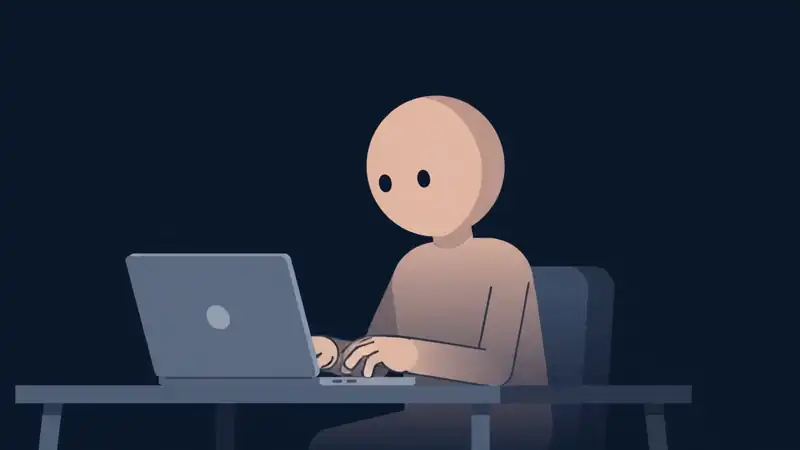
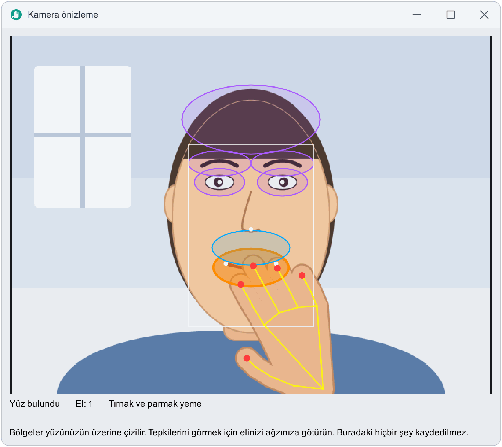
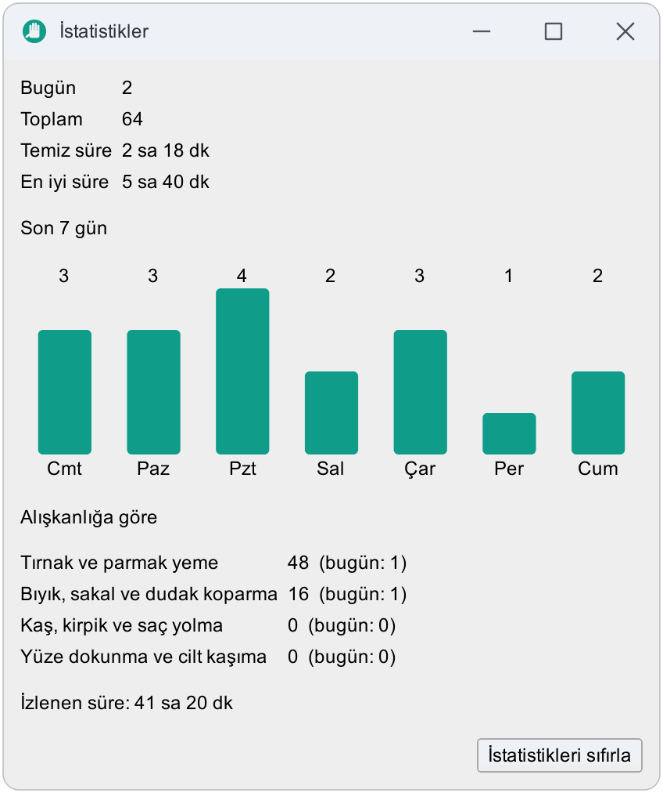
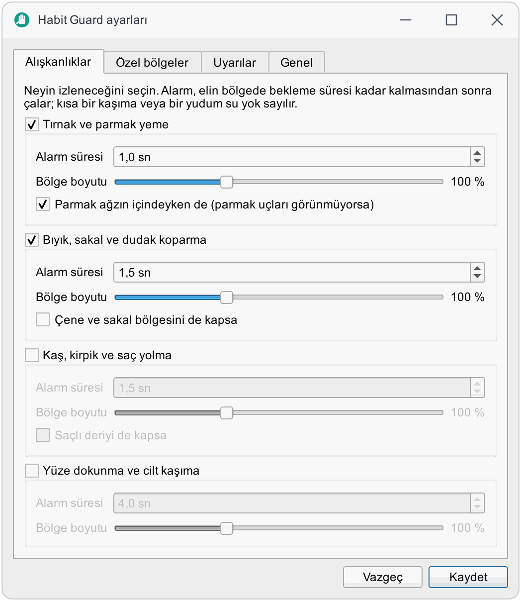
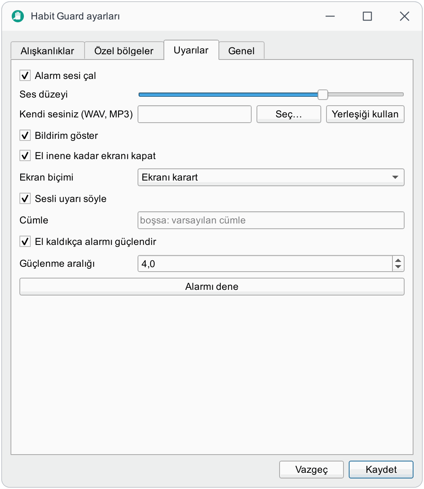
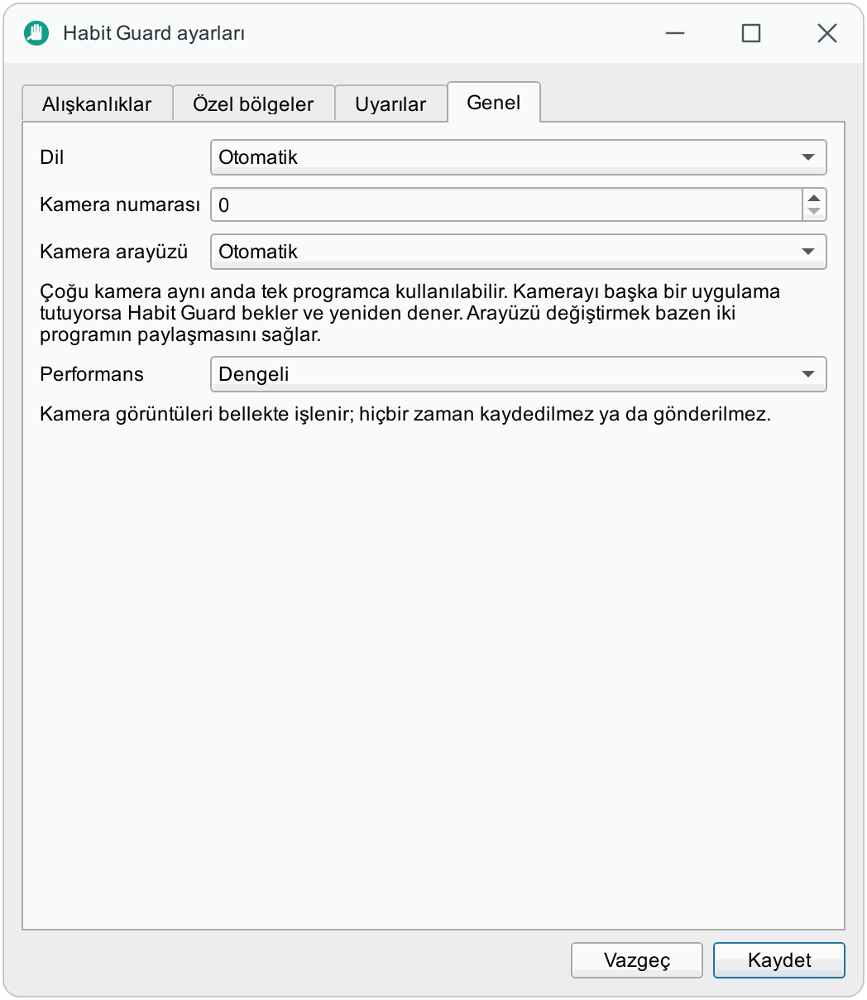
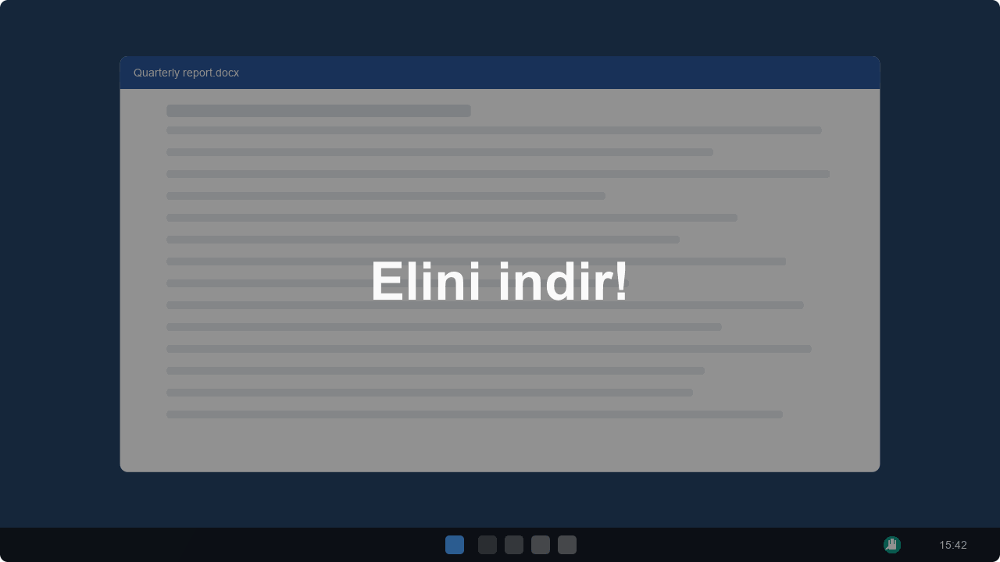
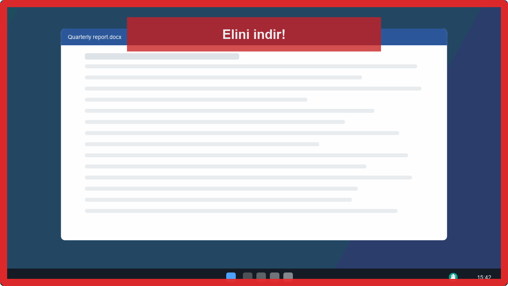
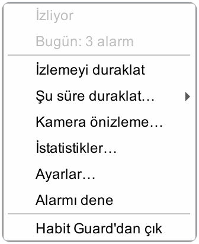
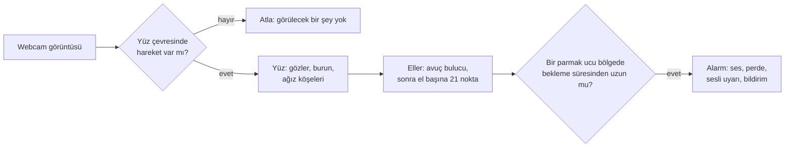

<p align="center">
  
</p>

<h1 align="center">Habit Guard</h1>

<p align="center">
  Elinizin ağzınıza, bıyığınıza, kaşınıza ya da saçınıza giderken yakalar ve bırakmanız için dürter.<br>
  Webcam tabanlı, çevrimdışı ve işlemciyi yormaz. Windows, macOS ve Linux.
</p>

<p align="center">
  <a href="https://github.com/bugraskl/habit-guard/actions/workflows/ci.yml"></a>
  <a href="https://github.com/bugraskl/habit-guard/releases"></a>
  <a href="docs/privacy.md"></a>
  <a href="docs/privacy.md"></a>
  <a href="LICENSE"></a>
</p>

<p align="center">
  <a href="https://bugraskl.github.io/habit-guard/tr/"><b>Web sitesi</b></a> · <a href="README.md">English</a> · <b>Türkçe</b>
</p>

> **Durum: alfa.** Algılama, alarmlar ve arayüz yazıldı ve otomatik testlerle kapsandı; algılama
> örnek fotoğraflarda ve oynatılan videoda denendi. Gerçek webcam ve masa başında şimdiye kadar çok
> az zaman geçirdi, bu yüzden yanlış alarm ve kaçırma bildirimleri şu an en değerli katkıdır
> ([nasıl bildirilir](CONTRIBUTING.md#reporting-a-problem)).

<p align="center">
  <a href="assets/video/demo.mp4"></a><br>
  <sub>On saniyede baştan sona. Uygulamanın ekran kaydı değil, yapay zekâ video aracıyla hazırlanmış bir çizimdir. <a href="assets/video/demo.mp4">MP4'ü açın</a>.</sub>
</p>

## Neden Habit Guard

Tırnak yemek, bıyık koparmak, kaş ya da kirpik yolmak, cildi kaşımak: bu alışkanlıklar otomatik
pilotta çalışır. Fark ettiğinizde el çoktan dakikalardır oradadır. Habit Guard webcam'inizi izler,
parmak ucunuz *sizin* alışkanlığınızın gerçekleştiği yere gidip orada kaldığında bunu fark eder ve
anında araya girer; böylece alışkanlığı fark etmeden sürdürmek zorlaşır.

Her şey kendi bilgisayarınızda olur. Kameradan gelen görüntü bellekte incelenir ve atılır; yalnızca
sayaçlar saklanır.

## Neyi izler

<p align="center">
  
</p>

| Alışkanlık | Nerede | Geniş alan (isteğe bağlı) |
|---|---|---|
| **Tırnak ve parmak yeme** | dudaklar ve çevresi | |
| **Bıyık, sakal ve dudak koparma** | burun ile ağız arası | çene ve sakal hattı |
| **Kaş, kirpik ve saç yolma** | kaşlar, göz kapakları, alın ve saç çizgisi | saçlı deri |
| **Yüze dokunma ve cilt kaşıma** | yüzün geri kalanı | |

Her alışkanlığın kendi **bekleme süresi** (alarmın çalması için elin ne kadar kalması gerektiği;
kısa bir kaşıma ya da bir yudum su yok sayılır) ve kendi **bölge boyutu** vardır. Bölgeler göz
mesafesi cinsinden ölçülür; öne eğilince, geri yaslanınca ya da başınızı yan yatırınca sizi takip
ederler.

## Sizi yakaladığında ne olur

**Ayarlar → Uyarılar** bölümünden istediğiniz birleşimi seçin:

| | Uyarı | Ne yapar |
|---|---|---|
| 🔔 | **Ses** | Önce yumuşak bir çınlama, sonra üç bip, devam ederseniz çalkalanan bir alarm. Ses düzeyi ayarlanır; kendi ses dosyanız (WAV, MP3, ...) yerleşik sesin yerine geçebilir. |
| 🌑 | **Ekran perdesi** | El inene kadar tüm monitörlerde ekran kararır ya da kırmızı bir çerçeve yanıp söner. Tıklamalar perdeden geçer, bu yüzden sizi asla dışarıda bırakamaz. |
| 🗣️ | **Sesli uyarı** | Sisteminizin çevrimdışı sesiyle seçtiğiniz bir cümleyi ("Elini indir.") söyler. |
| 💬 | **Bildirim** | Her olayın ilk alarmında bir masaüstü bildirimi. |
| 📈 | **İstatistik** | Gün ve alışkanlık bazında sayaçlar, 7 günlük grafik ve **temiz süre serisi**: son alarmdan beri ne kadar izlendiğiniz. Yalnızca yerelde saklanır. |

**Kademeli güçlenme** açıkken (varsayılan) el kaldıkça alarm birkaç saniyede bir artar: önce daha
sessiz, sonra daha yüksek ve daha karanlık. Yemek yerken ya da görüşme yaparken tepsiden izlemeyi
15 dakika, bir saat ya da üç saat duraklatabilirsiniz.

## Ekran görüntüleri

Pencereler gerçek olanlardır, İngilizce ve Türkçe. Önizlemedeki kamera görüntüsü bir fotoğraf değil, çizimdir: bu depoda gerçek bir yüz yok.

<p align="center">
  
  
</p>

<p align="center">**Kamera önizleme** bölgeleri yüzünüzde ve elin 21 noktasını gösterir; **İstatistikler** 7 günlük grafik ve temiz süre serinizi tutar.</p>

<p align="center">
  
  
  
</p>

<p align="center">**Ayarlar**: kendi bekleme süresi ve bölge boyutuyla alışkanlıklar, uyarılar ve genel seçenekler.</p>

<p align="center">
  
  
</p>

<p align="center">**Alarm**: el inene kadar ekran kararır (solda) ya da kırmızı bir çerçeve yanıp söner (sağda). Tıklamalar doğrudan geçer.</p>

<p align="center">
  
</p>

<p align="center">**Tepsi menüsü**: duraklat, şu süre duraklat, önizleme, istatistikler, ayarlar.</p>

Daha fazla görüntü ve tıklayabileceğiniz bir demo [web sitesinde](https://bugraskl.github.io/habit-guard/tr/).

## Nasıl çalışır



- **Görüntü işleme.** YuNet yüzü, MediaPipe'ın avuç ve el-nokta ağları (OpenCV'nin DNN modülüyle
  çalıştırılır) elleri bulur. MediaPipe *çalışma zamanı* kullanılmaz, çünkü bir telemetri yükleyicisi
  içerir ([neden](docs/privacy.md#why-not-the-mediapipe-runtime)).
- **Tasarım gereği ucuz.** Eller uzaktayken görüntüye saniyede yaklaşık iki kez bakılır ve yalnızca
  yüz çevresinde bir şey kıpırdadıysa incelenir. El yaklaşınca hızlı inceleme başlar.
- **Karar.** Bir bölgedeki parmak ucu bir "seri" başlatır; kısa kopmalar seriyi bitirmez; alarm
  bekleme süresinden sonra çalar ve el kaldıkça güçlenir ([mimari](docs/architecture.md)).

## Gizlilik

| Söz | Nasıl doğrulanır |
|---|---|
| Ağ erişimi yok: telemetri, hesap ve güncelleme denetimi yok. | `scripts/check_privacy.py`, `src/` altındaki herhangi bir dosya bir ağ kütüphanesini içe aktarırsa CI'ı başarısız kılar. |
| Kamera görüntüleri bellekte incelenir ve asla kaydedilmez. | Aynı tarama, OpenCV'nin görüntü ve video yazıcılarında ve Qt görüntülerini kaydetmede CI'ı başarısız kılar. |
| Yalnızca sayılar saklanır: günlük sayaçlar ve ayarlarınız, düz JSON olarak. | Yapılandırma klasörünüzdeki `settings.json` ve `stats.json`. |
| Duraklatmak kamerayı serbest bırakır. | Webcam ışığı söner. |

Ayrıntılar: [gizlilik](docs/privacy.md).

## Performans

Windows 11, AMD Ryzen 7 3700X (8 çekirdek, 16 iş parçacığı) üzerinde `habit-guard bench` ile ölçüldü;
ölçümün tekrarlanabilir olması için 640×480 bir klip oynatıldı. İşlemci kullanımı tüm süreci kapsar.

| Durum | Dengeli profil |
|---|---|
| Yüz görüşte, eller uzakta (günün çoğu) | makinenin **%0,34**'ü (bir çekirdeğin %5,5'i) |
| Aynısı, **Eko** profili | makinenin %0,24'ü |
| El yüze yakın (saniyede 8 kereye kadar inceleme) | makinenin yaklaşık %1,3'ü (bir çekirdeğin %20'si) |
| Tek bir inceleme (yüz + el) | 20 ila 26 ms |

Bunlar oynatılan klip sayılarıdır: canlı kamera kendi sürücü maliyetini ekler. Kendi makinenizde
ölçmek için `habit-guard bench` çalıştırın. Profili **Ayarlar → Genel → Performans** altından seçin.

## İndirme

| Platform | Paket | |
|---|---|---|
| **Windows** 10/11 x64 | Kurucu `.exe` ya da taşınabilir `.zip` | [İndir](https://github.com/bugraskl/habit-guard/releases/latest) |
| **macOS** 14+ Apple silicon | `.dmg` | [İndir](https://github.com/bugraskl/habit-guard/releases/latest) |
| **Linux** x86_64 | `.AppImage` ya da `.tar.gz` | [İndir](https://github.com/bugraskl/habit-guard/releases/latest) |

Her sürümle birlikte `SHA256SUMS.txt` ve GitHub yapı kaynağı (provenance) doğrulamaları gelir.
Paketler henüz kod imzalı değil: Windows'ta SmartScreen uyarabilir (*Ek bilgi*, sonra *Yine de
çalıştır*); macOS'ta ilk seferde uygulamaya sağ tıklayıp *Aç*'ı seçin, sonra kameraya izin verin.
Windows kurucusu kullanıcı başınadır (yönetici hakkı gerekmez) ve `habit-guard` komutunu PATH'inize
ekleyebilir. Paketleri kendiniz derlemek için: [derleme](docs/building.md).

## Kaynaktan çalıştırma

[uv](https://docs.astral.sh/uv/) gerekir (doğru Python'u kendisi getirir). Intel Mac'te Habit
Guard'ı çalıştırmanın yolu da budur.

```bash
git clone https://github.com/bugraskl/habit-guard.git
cd habit-guard
uv sync
uv run habit-guard
```

Tepsiye (macOS'ta menü çubuğuna) bir el simgesi gelir. İlk açılışta ayarlar penceresi açılır:
izlemek istediğiniz alışkanlıkları seçin. Bölgeleri kendi yüzünüzün üzerinde görmek ve kameranın
sizi iyi görüp görmediğini denetlemek için tepsi menüsünden **Kamera önizleme**'yi kullanın.

Linux'ta dağıtımınızın `libxcb-cursor0` (Debian/Ubuntu) ya da `xcb-util-cursor` (Fedora, Arch)
paketi ve sistem tepsisi olan bir masaüstü gerekir (GNOME tepsi simgeleri için bir eklenti ister).

Bilgisayarla birlikte başlatmak için: `habit-guard autostart enable` ya da Windows kurucusundaki
kutuyu işaretleyin.

## Komut satırı

Örneklerde `habit-guard` kullanılıyor; kaynaktan bu `uv run habit-guard`, Windows kurucusuyla yeni bir
terminalde `habit-guard` (PATH seçeneği işaretliyse) ya da kurulum klasöründeki
`habit-guard-cli.exe` olur.

```bash
habit-guard                       # tepsi uygulamasını başlat
habit-guard doctor                # hata bildirimleri için tanılama (içinde görüntü yok)
habit-guard doctor --probe-cameras
habit-guard selftest              # modelleri, görüntü kodunu, sesleri ve pencereleri denetle
habit-guard bench                 # işlemci kullanımını ve inceleme süresini ölç
habit-guard stats                 # sayaçlarınızı yazdır
habit-guard autostart enable      # oturum açılışında başlat (enable | disable | status)
habit-guard reset                 # ayarları ve istatistikleri unut
habit-guard ctl pause             # çalışan uygulamayı yönet: status, pause, resume, toggle,
                                  # test, settings, preview, stats, quit
habit-guard --camera 1            # başka bir kamera, ya da --camera klip.mp4 ile video oynat
habit-guard --config-dir KLASÖR   # ayarları ve istatistikleri seçtiğiniz klasörde tut
```

`habit-guard ctl` ile eylemleri kendi klavye kısayollarınıza bağlayabilirsiniz. Windows'ta
`habit-guard-cli.exe ctl toggle` için bir kısayol oluşturup özelliklerinden kısayol tuşu verin;
macOS'ta Kısayollar ya da Automator ("Kabuk Komutu Çalıştır"); Linux'ta masaüstünüzün özel
kısayolları. Çalışan uygulamayla ağ üzerinden değil, ayarlar klasöründeki küçük dosyalarla
konuşur. Çalışmayan bir uygulamaya komut 3 koduyla çıkar.

## Bilmeniz gerekenler

- **Kamera başına tek program.** Çoğu webcam aynı anda tek programca kullanılabilir. Kamerayı başka
  bir uygulama (görüntülü görüşme, başka bir izleyici) tutuyorsa Habit Guard birkaç saniyede bir
  yeniden dener; tepsi menüsü bunu söyler. **Ayarlar → Genel → Kamera arayüzü** bazen iki programın
  tek kamerayı paylaşmasını sağlar.
- **Işık ve açı.** Kamerayı, yüzünüz ve kaldırdığınızda iki eliniz görüntüde olacak, yüzünüze ışık
  gelecek şekilde yerleştirin. Önizleme penceresi uygulamanın tam olarak ne gördüğünü gösterir.
- **Tıbbi cihaz değildir.** Habit Guard bir kendi kendine yardım aracıdır. Bir alışkanlık size zarar
  veriyor ya da sıkıntı yaratıyorsa bir doktor ya da terapistle konuşmaya değer; birçok kişi bu tür
  hatırlatıcıları bir yerine koyma değil, yararlı bir ek olarak buluyor.

## Platform desteği

| | Windows | macOS | Linux X11 | Linux Wayland |
|---|:---:|:---:|:---:|:---:|
| Algılama ve alarmlar | ✅ | ⚠️ | ⚠️ | ⚠️ |
| Ekran perdesi | ✅ | ⚠️ | ⚠️ | ❌¹ |
| Sesli uyarı | ✅ | ✅ (`say`) | ⚠️ (`spd-say` ya da `espeak`) | ⚠️ |

✅ Windows 11'de gerçek bir kameranın karşısında geliştirildi ve kullanıldı. ⚠️ bunun için yazıldı:
CI üç sistemde paketleri derliyor ve paketlerden `habit-guard selftest` çalıştırıyor (modeller,
görüntü kodu, sesler ve pencereler), ama yazar gerçek kamerayla henüz denemedi; bildirimler
memnuniyetle karşılanır.
¹ Bazı Wayland bileşenleri tıklamayı geçiren pencereleri yok sayar; perde o zaman tıklamaları
engelleyebilir. Böyle olursa uyarı ayarlarından kapatın.

## Dokümantasyon

[Bölgeler ve ayar](docs/zones.md) · [Yapılandırma](docs/configuration.md) ·
[Derleme](docs/building.md) · [Mimari](docs/architecture.md) · [Gizlilik](docs/privacy.md) ·
[Sorun giderme](docs/troubleshooting.md) · [Katkı](CONTRIBUTING.md) ·
[Değişiklik günlüğü](CHANGELOG.md)

## Teşekkürler

Habit Guard; [OpenCV](https://opencv.org/) DNN modülü, Google'ın
[MediaPipe](https://ai.google.dev/edge/mediapipe) el modellerinin
[OpenCV Zoo](https://github.com/opencv/opencv_zoo) ONNX dönüşümleri (Apache-2.0), YuNet yüz
algılayıcısı (MIT) ve [Qt for Python](https://doc.qt.io/qtforpython-6/) üzerinde durur. Lisanslar ve
kaynaklar: [`NOTICE.md`](src/habit_guard/vision/models/NOTICE.md). [Eye Tracker](https://github.com/bugraskl/eye-tracker)
ile aynı anlayışla yapılmıştır.

## Lisans

[MIT](LICENSE)
